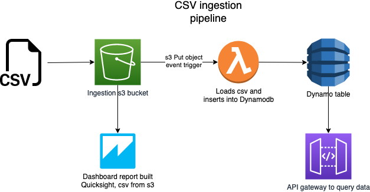

# Technical assesment 

## What is it
What I have built is event driven architecture to load data into a table and have it accessable to technical and non-technical stakeholders. The data is held in a database and is available in a api as well as a dashboard (For the non-technical stakeholder).

### Principals I have followed
- Keep it simple, 1 pipeline, 1 database and 1 api
- All of this is to show how I code and how i approach problems, the dashboard and api are not production ready.
- Any time building infrastructure is time well spent.

# Tasks
## Problem solving
### Assumptions
Common-preference
1. The minimum number any value can be is the length of the value
    e.g the prefix will always start with a length of 0 with the suffix having a len of the value
2. You want the maximum amount of matachable text. 
    eg if the text is abc and the match is abc. That is 3, rather than 1 as a matches with a.

All tests are contained in the folders of the code it is testing. I usually do this for Lambda functions to put the tests in the same place as the function (especially if there is multiple functions in the same code base, and i build from asset). This way it uploads to AWS, so if anyone needs to check my lambda function they have more code/info to debug. Costs a little in space, but minimal compared to the value. 

# AWS 
## CSV ingestion pipeline 

### Basic stack
csv -> s3 -> dynamodb -> api gateway

### Visulisation stack
s3 -> Quicksight -> dashboard
[Quicksight dashboard](https://eu-central-1.quicksight.aws.amazon.com/sn/dashboards/6b406573-0b54-4377-b13f-9ce15aa63178/sheets/6b406573-0b54-4377-b13f-9ce15aa63178_a7b1db2a-b95d-407b-b5ef-fa9dd74b7b89)

### Infrastrucutre diagram


### Code details
Problem solving:
    Pretty self explanatory, all tests within the folders of the challenge

aws:
    bin: Main stack 
    lib: Individual stacks
    src: Lambda functions 

All tests within the lambda folders functions as explained above. 

To run tests, run 'pytest' from the root folder

### To deploy 

Make sure you have the AWS CDK installed
```
    npm install -g aws-cdk
```

Bootstrap the project if its the first time CDK has run in your region
```
    cdk bootstrap
```

Synth the stacks locally 
```
    cdk synth --all 
```
Deploy
``` 
    cdk deploy --all
```

I did not upload the file as part of the CDK, I left it to upload to simulate the put request. 
To try this at home, from the root directory folder upload the data to the bucket (You need aws cli installed).
```
aws s3 cp assets/data.csv s3://postnlpipelinestoragebucket
```