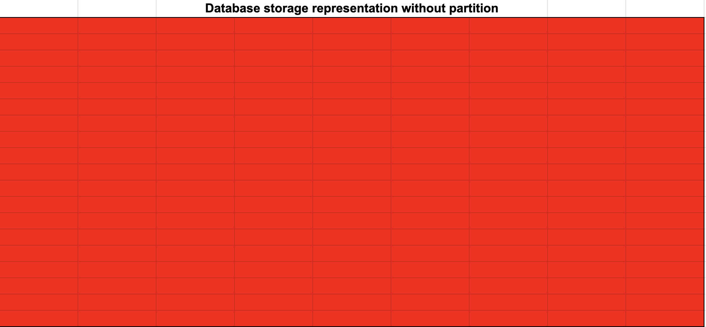
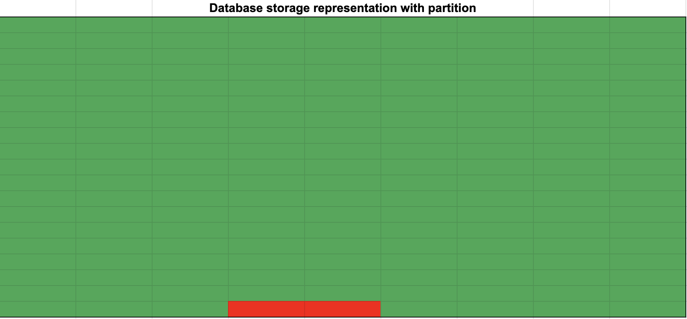

# Technical assessment 

# Please read first
When I submitted the first assessment, I didn't have the full context as to the role and what you were looking for in the technical assessment. Upon talking with Bobbie in the interview I got a better understanding as to the requirements and released the initial submission that was not well suited to the task. Rather than this just being a coding task it is related to a problem I would likely face in the role. This was weighing on me over the weekend, so I decided to recode the solution to better address the problem in the context of the new information I had learnt about the role. 

Things not well suited:
    1. DynamoDB is not a good db for data warehousing. It has limited features and querying, something which would have to be outsourced to the API, which is complex and requires training.
    2. An API is a great way of sharing data but the technical debt you take on is a lot. You need to maintain the code, write documentation, as well as train staff on usage. 
    3. No T in ETL was done on the data. When mocking up a POC I generally use DynamoDB as it's quick and easy to get data into. If you were to move the project out of POC, I change the DB to a more appropriate option. As long as it has been built with a microservice design, you can change databases with 'relative' ease. This is the approach I took for this challenge, but I now see the need to show my knowledge of SQL based databases in AWS.

# Version 2.0

## What is it
What I have built is event driven architecture to load data from an s3 bucket into another s3 bucket in a structured manner. Using Glue and Athena you can query the data using SQL code (I am a fan boi of Athena dialect, having a try() function in sql is a game changer). This architecture most aligns with the type of data that you are using (Finance data) and is better suited to this use case. 

## Things i would do better next time
In an attempt to keep this project simple, I used AWS Lambda to extract and load the data. AWS usage/log data is highly consistent and I felt using another more powerful ETL process (GLue with PySpark) would complicate the process. In hindsight this was a mistake, as the dataset has some little easter eggs inserted into it for us to find and transform, which the approach I have taken was not very good at doing (Hopefully i found them all).

## The Why
    1. This dataset is too large for analysts, data-engineers and reporting teams to query the data easily, without substantial knowledge of the dataset. Providing more structure to the data and reducing overall table size will allow for easier access and reduce total table usage (1 team may only need half the data of another). To do this I split the data into subgroups, using the prefix column name (name.split('/)[0]) as the higher level grouping and then the suffix (name.split('/)[1]) as the individual name. This allows you to split the tables up into logical column partitions, and store the data across multiple tables. (Also worth noting that without the prefix, the suffixes are not all unique).

    2. There are a lot of empty columns in the dataset, this would make it a nightmare for general querying by analysts. For this reason I designed base tables (With a common key), that can be joined to create a view to allow real time querying of the tables, without the additional columns and complicated naming convention.

    3. If this project is to scale, cost management is an important part of the design. Minimising data scanned with Athena is a way of reducing the compute costs low, and follows AWS's best practice for table design. The splitting of data into folder structures that allow Athena to query the data more efficiently can reduce costs as well as speed up transactions. For this reason I have split the data into partitions based on awsaccountnumber, year, month, day of 'bill/BillingPeriodEndDate' column. This will allow for less data to be scanned for queries, as I am imagining they would be the most common filters in the result set.

    4. If there are additional columns added to the dataset (CSV file supplied by Amazon), the data would be able to flow through to the database s3 bucket. The way the Lambda function is written is it takes the values from the dataset and builds the structure. If you would want to bring that data into your database, you could modify the table and include it in the table, with minimal changes to any underlying code. 

    5. To minimise data storage costs, I have removed any files that contain no data. As there are many unused columns, a lot of the data can be trimmed out of the data storage. The functionality will not return any data for those queries, as no data exists but empty files are not required to be stored in s3. 

    6. There is no schema available for this data so the empty columns makes this a nightmare from a data engineering perspective. You could use Glue's automatic schema discovery tool to get around this, and auto assign dtypes if an empty field in the sample data was populated in production. A couple things with this, I am not a fan of implicit data types, this can cause a lot of issues in production and can cause errors in loading if the wrong datatype was inferred. For this reason i have set the default dtype to String for all unknown columns. This will have the data as a string variable, that can be modified if the data is to be used by a team. This ensures that the tables are created to scale with changes to the dataset without needing any modification to the underlying code (might just need a dtype change to the column).

    7. I have designed a simplified view on top of the base tables (Prefix of the columns), to allow for a single unified view of the data. This allows for a reduced column volume as standard as the default view, with the ability to add additional columns to the view if required. 

### Principals I have followed
- Keep it simple.
- A simple, cost effective solution that is quick and reliable will allow for teams to self-serve and use this data.
- Teams should be able to query the data. 
- This is more tackling the data engineering problem rather than presenting the data in a dashboard. This would be one way to present the data to non-technical stakeholders that would allow them to query the data easily. I think a high quality dashboard would be needed for this solution to allow for non-technical stakeholders to access the data. 

### New solution: 
The new solution is looking at importing data from the AWS usage with the following requirements:
    1. It needs to scale
    2. It needs to be available to teams to use the data
    3. It needs to be cost effective (more on that later)
    4. it needs to be accurate (Its finance data afterall)

## Infrastructure

## How the partitions work
With AWS Athena (and other databases, eg Snowflake) data is stored in micro partitions, where you can structure the data into logical partitions to reduce the query load. This reduces compute costs substantially. The particions used for this database are accountnumber, year, month and day. 

Here is a visual representation as to where Athena would have to look for data, if you didn't set up partitions. The red square representing data to read


Here would be the the same s3 bucket storage map, with logical partitions are added to the s3 bucket. 


More details can be found in the aws documentation [link](https://docs.aws.amazon.com/athena/latest/ug/partitions.html)


# Version 1.0
## What is it
What I have built is event driven architecture to load data into a table and have it accessible to technical and non-technical stakeholders. The data is held in a database and is available in a api as well as a dashboard (For the non-technical stakeholder).

### Principals I have followed
- Keep it simple, 1 pipeline, 1 database and 1 api
- All of this is to show how I code and how I approach problems, the dashboard and api are not production ready.
- Any time building infrastructure is time well spent.

# Tasks
## Problem solving
### Assumptions
Common-preference
1. The minimum number any value can be is the length of the value
    e.g the prefix will always start with a length of 0 with the suffix having a len of the value
2. You want the maximum amount of matchable text. 
    eg if the text is abc and the match is abc. That is 3, rather than 1 as a match with a.

All tests are contained in the folders of the code it is testing. I usually do this for Lambda functions to put the tests in the same place as the function (especially if there is multiple functions in the same code base, and i build from asset). This way it uploads to AWS, so if anyone needs to check my lambda function they have more code/info to debug. Costs a little in space, but minimal compared to the value. 

# AWS 
## CSV ingestion pipeline 

### Basic stack
csv -> s3 -> dynamodb -> api gateway

### Visulisation stack
s3 -> Quicksight -> dashboard

### Infrastructure diagram


### Code details
Problem solving:
    Pretty self explanatory, all tests within the folders of the challenge

aws:
    bin: Main stack 
    lib: Individual stacks
    src: Lambda functions 

All tests within the lambda folders functions as explained above. 

To run tests, run 'pytest' from the root folder

# API usage
The api is simple, it either does a scan of all columns and values if no arguments are passed. If you want to reduce the column size and return only specific columns add details to the headers as follows. 

headers = {columns:[list_of_columns]}

### To deploy 

Make sure you have the AWS CDK installed
```
npm install -g aws-cdk
```

Bootstrap the project if its the first time CDK has run in your region
```
cdk bootstrap
```

Synth the stacks locally 
```
cdk synth --all 
```
Deploy
``` 
cdk deploy --all
```

I did not upload the file as part of the CDK, I left it to upload to simulate the put request. 
To try this at home, from the root directory folder upload the data to the bucket (You need aws cli installed).
```
aws s3 cp assets/data.csv s3://postnlpipelinestoragebucket
```
